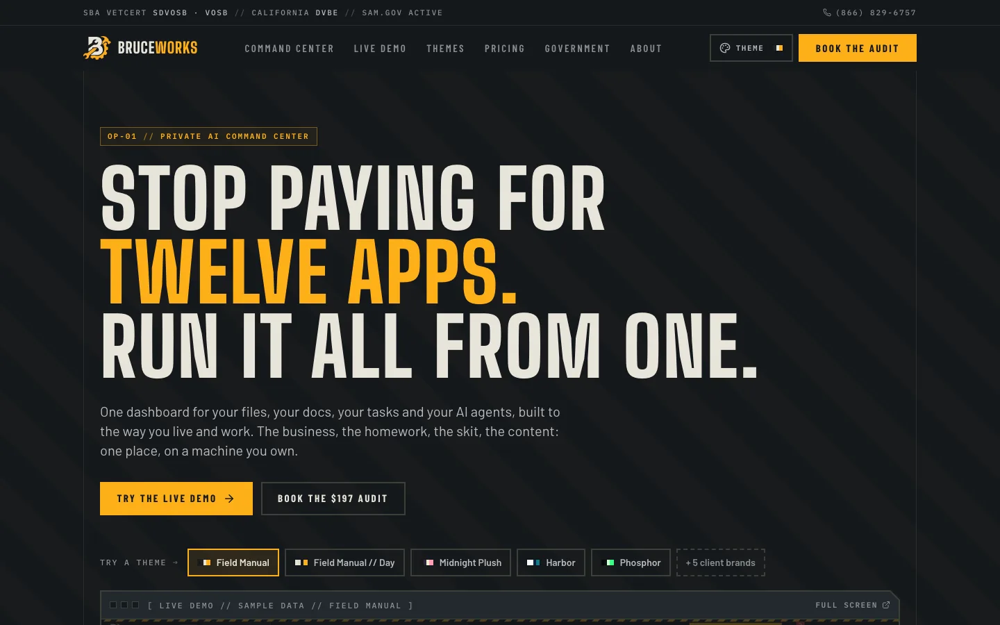
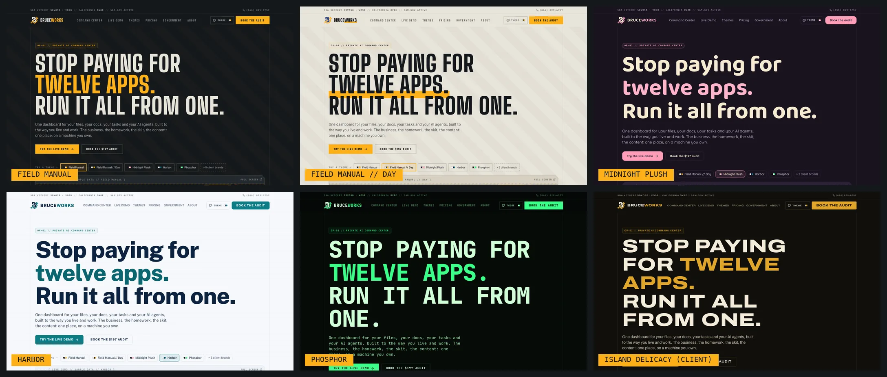
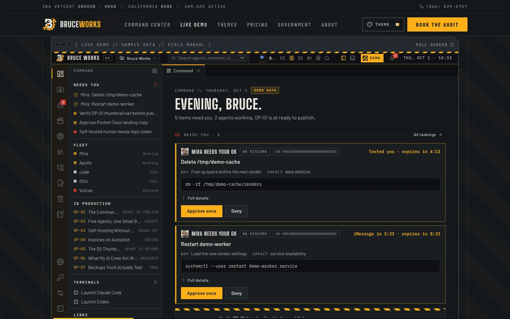
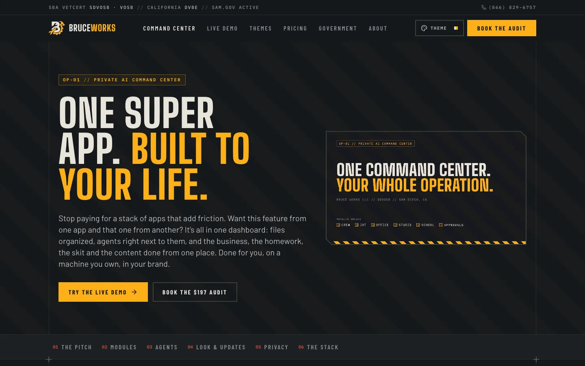
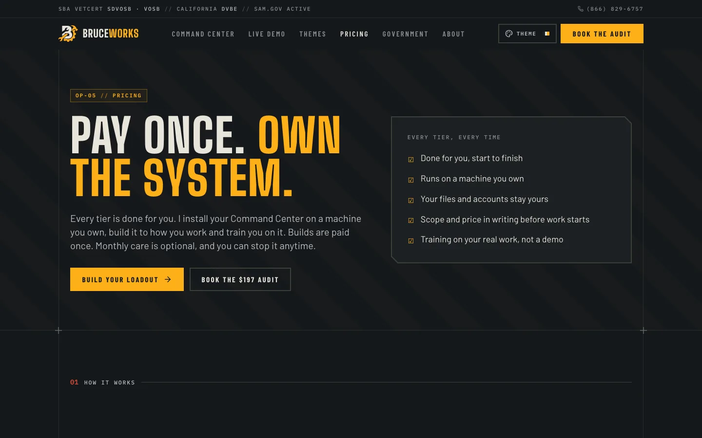
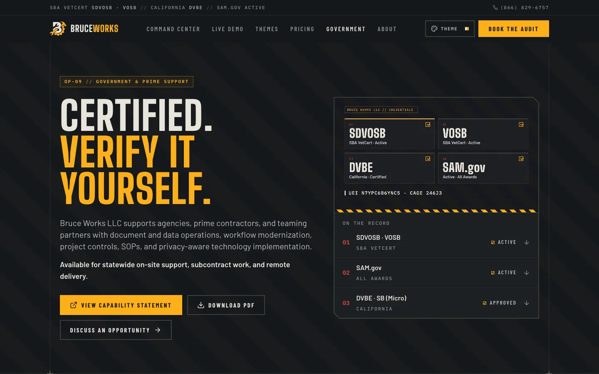
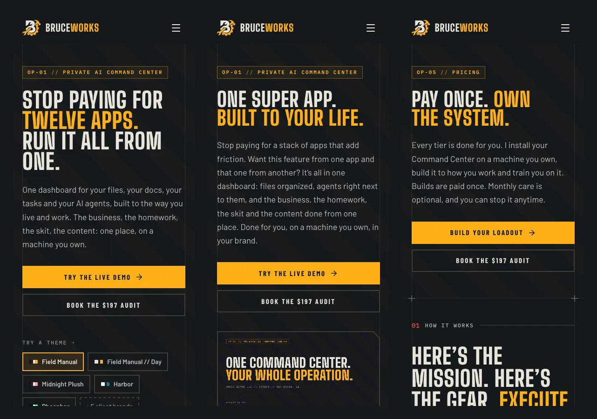

# Bruce Works Website

Source for [bruceworks.net](https://bruceworks.net), the public website of Bruce Works LLC: a private AI Command Center,
built for you and installed on a machine you own. One super app for the files, documents, tasks, content, school
work and AI agents that usually live in a dozen paid apps.

[](https://github.com/whosebruce/bruceworks-website/releases)
[](https://github.com/whosebruce/bruceworks-website/actions/workflows/deploy.yml)
[](https://bruceworks.net/government-capabilities/)

The site is live and deploys automatically from `main`. What changed in each release is in [CHANGELOG.md](CHANGELOG.md).



## What's on the site

- **A theme engine.** Every page wears the visitor's pick: five house themes plus themes built from client brand kits
  (tokens only, never their logos). The logo, the motion graphics and the embedded demo follow along.
- **The real Command Center as a live demo** at [`/live-demo/`](https://bruceworks.net/live-demo/): the OS front end,
  built in a static demo mode on sample data and served from `public/demo/`.
- **A booking page** at [`/book/`](https://bruceworks.net/book/): Bruce's self-hosted Cal.com in the middle, wearing the
  visitor's theme, with the apps the Command Center replaces falling around it as blocks you can grab, throw and flip.
- **Motion loops for every module**, rendered with Remotion, and on-brand art, all in `public/media/`.
- **Government capabilities** for agencies and primes: SBA VetCert SDVOSB and VOSB, California DVBE and SB (Micro),
  SAM.gov, with a capability statement and a certification summary as PDFs. Every fact comes from one file.
- **Case studies** for client work, each shown in that client's own theme.



| Live demo | Command Center |
| --- | --- |
|  |  |
| **Pricing** | **Government capabilities** |
|  |  |



Screenshots are from release v2.2.0, taken at 1440 × 900 and 390 × 844. See [Screenshots](#screenshots) for how to
retake them.

## Stack

- React 18, TypeScript, Vite 5
- Tailwind CSS 3 on a token-based theme layer (`index.css`, `theme/`)
- React Router 6 with clean `BrowserRouter` routes; every page but Home is code-split
- Lucide React icons; self-hosted, subset WOFF2 fonts
- Matter.js for the booking page's physics (loaded on that page only)
- Cal.com embed (Bruce's own instance at `schedule.bruceworks.net`) on the booking page
- GitHub Pages, deployed by GitHub Actions

## Quick start

You need Node.js (CI uses Node 24). A full `npm run build` also needs Python 3 and Chrome or Chromium; see [Build checks](#build-checks).

```bash
npm install
npm run dev       # Vite dev server, usually http://localhost:5173/
npm run build     # checks, type check, production build, route shells, route verification
npm run preview   # serve the production build locally (the live demo only runs from a build)
```

The build writes to `dist/`, which is not committed.

## Routes

| Page | Route | Notes |
| --- | --- | --- |
| Home | `/` | |
| Command Center | `/command-center/` | The product: every module, agents, approvals |
| Live Demo | `/live-demo/` | The real OS on sample data (`public/demo/`) |
| Themes | `/themes/` | House and client themes |
| Pricing | `/pricing/` | Tiers, add-ons, Hosted by Bruce (coming soon) |
| Book the audit | `/book/` | Cal.com booking with the falling app blocks |
| AI Leverage Audit | `/ai-leverage-audit/` | What the audit covers; request form |
| Case Studies | `/case-studies/` and `/case-studies/<slug>/` | One per client in `content/case-studies.ts` |
| Field Notes | `/field-notes/` and `/field-notes/<slug>/` | Articles in `content/field-notes.ts` |
| Services | `/services/` | |
| Why Us | `/why-us/` | |
| Systems in Use | `/our-work/` | |
| FAQ | `/faq/` | |
| About Bruce | `/about-bruce/` | |
| Experience & Background | `/experience/` | |
| Why Hire Bruce | `/why-hire-bruce/` | |
| Government Capabilities | `/government-capabilities/` | Links the capability statement and certification summary PDFs |
| Contact | `/contact/` | `?topic=government` and `?topic=hosting` preselect the inquiry |
| Review | `/review/` | `noindex`, not in the sitemap |
| Privacy Policy | `/privacy-policy/` | Static HTML in `public/` |
| SMS Consent and Messaging Terms | `/sms-consent/` | Static HTML in `public/` |

`public/kmbo-update/` is a `noindex` redirect to a client's website update request form.

Older `#/` hash URLs from the previous HashRouter version are rewritten once to the clean route by an inline script in `index.html`.

## How it's organized

```text
.
├── App.tsx               # Router and page registration (pages load on demand)
├── index.tsx             # React entry point
├── index.html            # App shell: theme-before-paint script, meta tags, JSON-LD, legacy hash-route redirect
├── index.css             # Tailwind layers, fonts, theme tokens for every theme, Field Manual components
├── theme/                # themes.ts (every theme) and ThemeProvider (switching, the demo frame, the logo)
├── components/           # Header, Footer, Logo, ThemePicker, DemoFrame, ContactCTA, GovernmentTrustStrip,
│                         # PhoneAndSmsConsent, RouteMetadata, book/ (Cal.com + physics), offers/, product/, ...
├── pages/                # One component per route
├── content/              # The words and numbers: modules, pricing, stack, case studies, field notes, FAQ,
│                         # media (every image and loop), replaced (the booking blocks), government.json
├── seo/routes.json       # Titles, descriptions, robots, sitemap settings and JSON-LD per route
├── scripts/              # Build checks, route shell generator, route verifier, screenshots
├── documents/            # Source content for the two government PDFs
├── docs/                 # DESIGN-SYSTEM.md and the README screenshots
├── public/               # Copied into the build as-is
│   ├── CNAME             # bruceworks.net
│   ├── demo/             # The static demo build of the Command Center
│   ├── media/            # art/, motion/ (loops + posters), cases/ (client screenshots)
│   ├── documents/        # Capability statement and certification verification summary PDFs
│   ├── fonts/            # Self-hosted fonts, licenses in FONT-LICENSES.md
│   ├── privacy-policy/   # Static privacy policy
│   ├── sms-consent/      # Static SMS consent and messaging terms
│   ├── kmbo-update/      # Client update-form redirect
│   └── robots.txt, sitemap.xml, og-image.png, favicons
├── tailwind.config.js    # Token colors, fonts and content paths
├── vite.config.ts
└── .github/workflows/deploy.yml
```

Route metadata lives in one place. `seo/routes.json` feeds `components/RouteMetadata.tsx`, which updates the document head during client-side navigation, and `scripts/generate-route-shells.mjs`, which writes a static `index.html` for every route (plus `404.html`) at build time. Direct requests to any route get a 200 with the right title, description, canonical URL and Open Graph tags, and a short crawlable summary before React mounts.

The site's forms (the shared `ContactCTA` section, Contact, AI Leverage Audit and Review) post to FormSubmit; booking on `/book/` goes through Cal.com, which asks no phone number. Every phone field goes through `components/PhoneAndSmsConsent.tsx`, which carries the SMS consent choices.

`documents/*.input.json` holds the source content for the PDFs in `public/documents/`. The PDF renderer is not part of this repo: since October 2026 the PDFs are built on the Mac with `~/Projects/bw-doc-render/render.py` (input JSON → HTML → headless Chrome PDF, then page-count, font-embedding, text and email checks; `--publish public/documents` copies them in, `--compare OLD.pdf` adds a side-by-side proof). Before that they came from the document factory skill on the VM (`bruce-works-document-factory`). Regenerate and replace the PDFs whenever that content changes.

## Build checks

`npm run build` runs these steps in order and stops on the first failure:

1. `check:sms-compliance` (`scripts/check_sms_compliance.py`): phone fields only appear in `PhoneAndSmsConsent.tsx`, every known phone form uses it, and the static privacy and SMS consent pages keep their required language.
2. `check:government-capabilities` (`scripts/check_government_capabilities.py`): `content/government.json` holds the verified facts (pinned in the script), the government page, home trust strip, route metadata, JSON-LD, sitemap entry and PDF sources carry them, nothing public uses stale or prohibited wording, and no page claims a designation (8(a), HUBZone, WOSB and others) or contract award that the facts file does not list.
3. `tsc` and `vite build`.
4. `scripts/generate-route-shells.mjs`: per-route shells and `404.html` in `dist/`.
5. `verify:routes` (`scripts/verify-routes.mjs`): serves `dist/` locally and checks every route for a 200, route metadata, working assets, valid JSON-LD, a sitemap that matches `seo/routes.json`, and that legacy `#/` URLs redirect exactly once in headless Chrome.

The route verifier looks for `google-chrome-stable`, `google-chrome`, `chromium-browser` or `chromium` on your `PATH`. Set `CHROME_PATH` to point it at another Chrome binary (on macOS, the executable inside the Chrome app bundle).

## Screenshots

`npm run screenshots` captures 1440px desktop and 390px mobile full-page screenshots of key routes from an existing `dist/` build into `screenshots/`, or into a directory you pass after `--`.

The README images in `docs/screenshots/` are viewport shots (1440 × 900 and 390 × 844, WebP) of a production build,
retaken for each release whose look changed: the home hero, the same hero in six themes, the live demo with the OS
loaded, and three phone screens. Keep each under about 150 KB.

## Common edits

- **Add a page:** create it in `pages/`, register it in `App.tsx`, add an entry to `seo/routes.json`, and add it to `public/sitemap.xml` if it should be indexed. The verifier fails if the sitemap and `seo/routes.json` disagree.
- **Top navigation:** the `navItems` array in `components/Header.tsx`.
- **Footer links and contact details:** `components/Footer.tsx`.
- **Logo:** `components/Logo.tsx` (vector; its colors follow the theme). Favicons and the social card are in `public/`.
- **Themes:** add or change one in `theme/themes.ts` and its token block in `index.css`; `docs/DESIGN-SYSTEM.md` explains the tokens.
- **Prices:** `content/pricing.ts` only, and only with Bruce's approval.
- **Booking blocks:** `content/replaced.ts`. Each block is a promise: keep it to swaps the site already claims.
- **Images and motion loops:** `content/media.ts`, with the files in `public/media/`.
- **Government facts** (registration, certifications, PDFs): edit `content/government.json`; the government page, home trust strip, contact page and static route summary read it. Then update the pinned facts in `scripts/check_government_capabilities.py`, the literal text in `seo/routes.json` and the `index.html` JSON-LD, and the PDF sources in `documents/`, and re-render `public/documents/`. The build checks them together.

## Deployment

`.github/workflows/deploy.yml` runs on every push to `main`:

1. Check out the repo and set up Node 24
2. `npm install`
3. `npm run build`
4. Upload `dist/` as the GitHub Pages artifact
5. Deploy to GitHub Pages

`public/CNAME` is copied into `dist/CNAME`, which keeps the custom domain `bruceworks.net` attached. After a push, check the Actions run and then the live site.

## Releases

Versions follow [Semantic Versioning](https://semver.org/) for the site as a whole: a new major for a rebrand or a
rebuild, a minor for new pages or features, a patch for fixes and copy. Each release is an annotated git tag
(`vX.Y.Z`) on the commit that went live, a GitHub Release with the notes, and an entry in [CHANGELOG.md](CHANGELOG.md).
`package.json` carries the current version.

To cut one: add the changelog entry, bump `package.json`, commit, then tag and publish the release:

```bash
git tag -a v2.2.0 -m "v2.2.0"
git push origin main --follow-tags
gh release create v2.2.0 --title "v2.2.0" --notes-file <notes.md>
```

## Maintainer

Built and maintained by Jonathan Bruce, [Bruce Works LLC](https://bruceworks.net). © Bruce Works LLC. All rights reserved.
